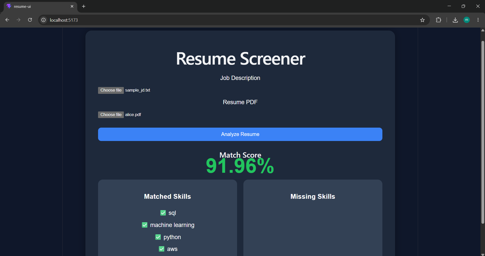

# AI Resume Screening System

An AI-powered Applicant Tracking System (ATS) that ranks resumes against job descriptions using NLP and semantic similarity.

## Features

* PDF Resume Parsing
* NLP Skill Extraction using spaCy
* Semantic Matching using Sentence Transformers
* Resume Ranking
* FastAPI Backend
* React Frontend

## Tech Stack

### Backend

* Python
* FastAPI
* spaCy
* Sentence Transformers
* Scikit-Learn

### Frontend

* React
* Vite
* Axios

## How It Works

1. Upload a Job Description
2. Upload one or more PDF resumes
3. Extract skills and semantic information
4. Score candidates
5. Rank candidates based on job fit

## Future Improvements

* Multi-candidate leaderboard
* Authentication
* Dashboard analytics
* Cloud deployment
